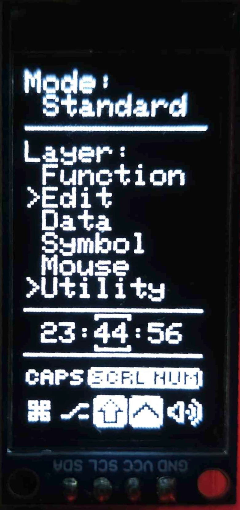
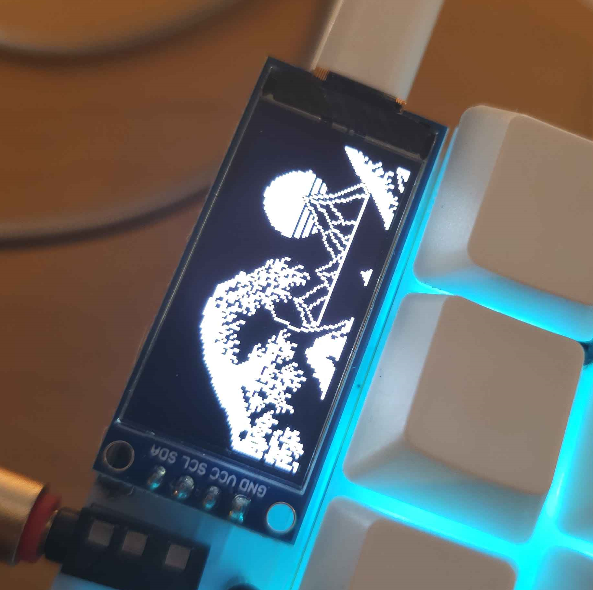

# Desync's Keymap

     

---
# Features

- Common symbols and punctuation accessible through combos with many duplicated on both sides; combos trigger through most layers.
- `Repeat` key on right thumb, `Magic` key on left thumb.
- Home block mods on main layer.
- [Achordion](https://getreuer.info/posts/keyboards/achordion/index.html) enabled with opposite hand triggers and typing streak detection for home block mod and `Repeat`/`Magic` layer-tap safety.
- Control key overrides for easier left-hand only use; overrides disabled on home block mods.
- Mouse emulation accessible on pinky key combo; movement keys in same position as arrow keys on navigation layer, scrolling underneath in vim layout.
- Numpad and Steno (GeminiPR) layers accessible through combos.

## Dynamic Keys

`Repeat` and `Magic` are dynamic keys that return different outputs depending on the previous key.

Despite the names, both keys have both magic and repeat functionality: default behaviour is to repeat keys on opposite hand and (generally) swap first and second row keys on same hand. This eliminates many SFBs, turning them into alternations for repeated keys and rolls for many other SFBs.

The most common use case for the same hand behaviour is for the vowel block on the right side, turning the `OE`, `EO`, `IU`, and `UI` SFBs into rolls; as well as the various index finger SFBs on both sides (i.e., in the words `T[YP]E`, `[SC]IENCE`, `[PH]ONE`, `[HY]PHEN` or `H[YP]HEN`, etc.).

Letters on opposite hand that are not commonly repeated (i.e. `I`, `Q`) are overridden and instead return common n-grams.

### Magic Key

Left hand keys:
|     |     |     |     |     |     |     |     |     |     |     |     |     |     |     |     |
| --- | --- | --- | --- | --- | --- | --- | --- | --- | --- | --- | --- | --- | --- | --- | --- |
| Prev  | `Z` | `L` | `D` | `C` | `B` | `N`   | `R` | `T`   | `S` | `G` | `Q` | `X` | `M`   | `W` | `V`  |
| Magic | `N` | `R` | `T` | `S` | `S` | `ION` | `L` | `ION` | `C` | `S` | `U` | `C` | `ENT` | `S` | `ER` |

Right hand overrides and combos/other:
|     |     |     |     |     |     |     |
| --- | --- | --- | --- | --- | --- | --- |
| Prev  | `J`   | `Y`  | `H`   | `I`  | `A`  | `K`  |
| Magic | `UST` | `OU` | `ERE` | `NG` | `ND` | `EY` |

(Other right hand keys are repeated.)

Other:
|     |     |     |
| --- | --- | --- |
| `⎵`   | `,`    | `.`   |
| `THE` | `⎵THE` | `COM` |

### Repeat Key

Right hand keys:
|     |     |     |     |     |     |     |     |     |     |     |     |
| --- | --- | --- | --- | --- | --- | --- | --- | --- | --- | --- | --- |
| Prev   | `J`   | `F` | `O` | `U` | `Y` | `H` | `E` | `I` | `A` | `K` | `P` |
| Repeat | `ECT` | `Y` | `E` | `I` | `P` | `Y` | `O` | `U` | `U` | `Y` | `Y` |

Left hand overrides:
|     |     |     |     |     |
| --- | --- | --- | --- | --- |
| Prev   | `B`      | `Q` | `V`  | `W`   |
| Repeat | `ECAUSE` | `U` | `ER` | `ITH` |

(Other left hand keys are repeated.)

Other:
|     |     |     |
| --- | --- | --- |
| `⎵`   | `,`    | `.`   |
| `AND` | `⎵AND` | `COM` |

---

Only alpha keys are tracked:

> `a 1 [Rep]` produces `a 1 a`.

Modifiers are not tracked (but the dynamic keys may be modified):

> `[Shift] a [Release shift] [Magic]` produces `A a`;
>
>` a [Shift] [Magic] [Release shift] ` produces `a A`.

Alpha keys pressed while the control modifier is active are not tracked:

> `a [CTRL] b [Release CTRL] [Magic]` produces `a ^b a`.

Duplicated keys are not tracked:

> `a b c c c c [BSPC] [Rep]` produces `a b c c c b` (`Rep` returns previous distinct tracked key `b`).

`Backspace` reverts the tracked key to the previous distinct key:

> `a b c [Rep]` produces `a b c c` (`Rep` returns `c`);
>
> `a b c [BSPC] [Rep]` produces `a b b` (`Rep` returns previous tracked key `b`).

For longer magic outputs, (e.g. `W -> WITH`) there is a short window (default 500ms) in which `Backspace` will delete the entire magic output (i.e. `WITH -> W` rather than `WITH -> WIT`). Pressing any other key will instantly close this window.

## OLEDs
(128x64 OLEDs)
### Right:
- Default layer and layer stack display;
- Menu key swaps layer stack to layout display;
- Clock -- time is set manually using keys on utility layer and doesn't require software on host (persists through sleep events);
- Custom locking key, modifier, and mute state indicators.

### Left:
- Cycles between text and logo with cyberpunk glich aesthetic animation (based on [this code](https://gist.github.com/aleksbrgt/48a8eb932dc1b6aa8f4b36ecd7c380d0));
- Logo displays WPM and current session time.

Key on utility layer available to change both OLEDs to static images.

# Combos

(Press `Esc`, `;`, and `#` to access Touhou layer and to see funky Cirno fumo on right OLED.)

---
- `Line` combos add empty lines above/below current position;
- `Join` combo joins current line to following line with space between;
- `Del` combos delete leftwards, current word, and rightwards.

# Layers
### Base

Base layer alphas is a slightly modified graphite layout, with home block mods, and magic/repeat keys on middle thumb keys.

I find it difficult to press upper row keys with my pinkies and end up alt fingering them with my ring fingers, which introduces some SFBs (`BL`, `BR`) with the default Graphite layout. So, `J` and `B` have been moved off the outer top row; `B` has also been placed next to `C` to make the common `B_C` string not a skipgram. (Also, I don't like `E` on the ring finger, so `HEIA` is used over `HAEI`.)

> ℹ️ Note that this keymap internally uses the QWERTY layer for combos, so this Base layer can be modified easily without needing any changes to combo code. 
> 
> ⚠️ However, per-key mod-taps settings and Achordion will still need to be handled separately if home block mods are changed.

`Comma`, `Dot`, `Scln`, `Colon`, `Dash`, and `Exlm` are compressed together or omitted, as they accessible from combos near or on the home row. `Hash` is included on base layer as I use it as a (La)TeX snippet trigger/leader key.

`Tab` is on right hand to reduce left hand contortions and to keep it on home row. `Tab` key also functions as `RShift` when held. `New Sentence` macro sends a dot, a space, then sets a one shot shift.

### Data

Number grid with `1`, `2`, and `3` on right hand home row, along with arithmetic and numerical symbols on left hand, sharing locations from `Symbol` and `Program` layers.

Function keys also available for left hand only usage.

### Edit

Navigation/editing keys on left hand and paired delimiters and common symbol combinations on right hand.

Many common strings are inward rolls on right hand, e.g.; `[]`, `()`, `{}`, `^{}`, `_{}`, `!()`, `?()`; right hand also duplicated on Symbol and Program layers.

`Select` macro by [Getreuer](https://getreuer.info/posts/keyboards/select-word/index.html) selects the current word and extends selection by one word per subsequent press; holding shift selects/extends selection by lines instead.

### Symbol

Symbol layout optimised for (La)TeX editing with many common strings as inward rolls on left hand, e.g.; `<-`, `<=`, `->`, `>=`, `|->`, `<-`, `~>`, `:-`, `&=`, etc. (Intended to be used with [snippet extensions](https://gist.github.com/DesyncTheThird/0c7a18dc6bedaf27e2627c07f0c53e17).) Brackets on right hand as above.

### Program

Program layer optimised for c programming, with comparison operators as inward rolls, logical/bitwise operators symbols grouped on index finger, etc. Brackets on right hand as above.

### Utility

Layer is accessible using either outer thumb key (XOR). Media control, RGB, and OLED control on left hand, and function keys on right hand.

`Base` swaps default layer to QWERTY layout; `Basic` swaps default layer to QWERTY layout with home block mods and `Space` layer-tap disabled (useful for games).

`Clock` keys set the OLED clock. `OLED Static` disables animations and changes OLEDs to static images. `OLED Menu` toggles between layer stack view and layout display on right OLED.

`Alt Tab` holds `LAlt` on first press and taps `Tab`; `LAlt` is released when layer key is released.

Tap the `Boot/Reboot` key to reboot keyboard, and hold for one second to enter bootloader.

### Mouse

Mouse emulation accessible on pinky key combo to allow mouse movement without moving from home row. Override cursor/scroll speed with right thumb keys.

### Control

Control key overrides with QWERTY-esque layout for easier left-hand only use. (I usually don't remember which *letter* does what command, only which key *position*.)

Overrides activate only from left hand control key; home block mods are unaffected, so intentional letter controls can be used in two-hand usage.

# Alt Base Layer
### QWERTY

Accessible with `Base` key on Utility layer, or `Basic` to also disable home block mods and `Space` layer-tap (for games).

> ⚠️ Modifying this layer will also require changing mod-tap and combo code.
